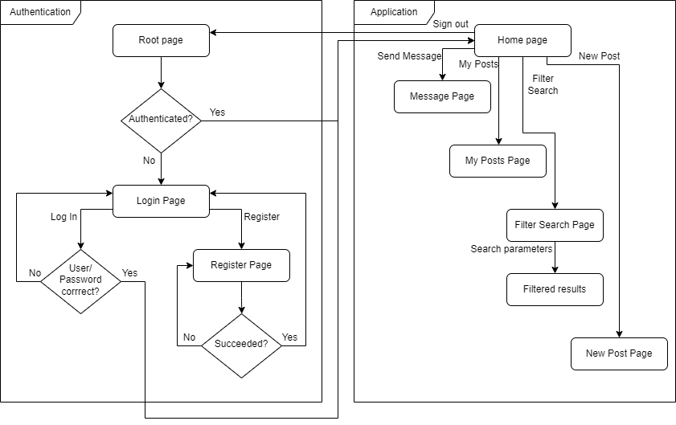
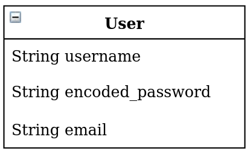
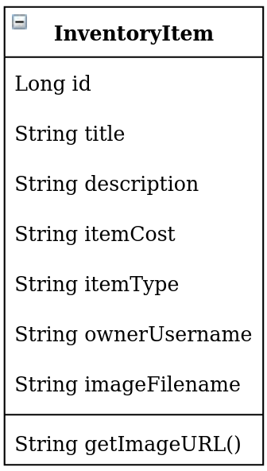
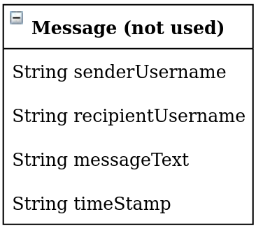

## Project Layout
### Flow chart

Illustrated above is a flow chart of the application layout. Each page is represented by a box and actions/conditions are represented by arrows.

### Models

#### User

The User model is mostly the same as in Project 1, but a new field has been added to store email addresses.

#### InventoryItem

The InventoryItem stores information on each item a user wishes to sell.
We implemented `title`, `description`, and `owner_username` first, as those fields are critical information used to describe the item and who owns it.
Next, we implemented additional fields such as `itemCost` (to store price information) and `itemType` (for sorting by category later).
Lastly, image upload capability was added, and the image filename is stored in the `imageFilename` field.
A helper function `getImageURL` takes our `AWS S3` endpoint URL and concatenates `imageFilename` to get the path to the image file, which is shown in HTML views.

#### Message

This model was ultimitely not implemented, but would have been used to store messages in a sort of "chatroom".
We decided to use email instead.