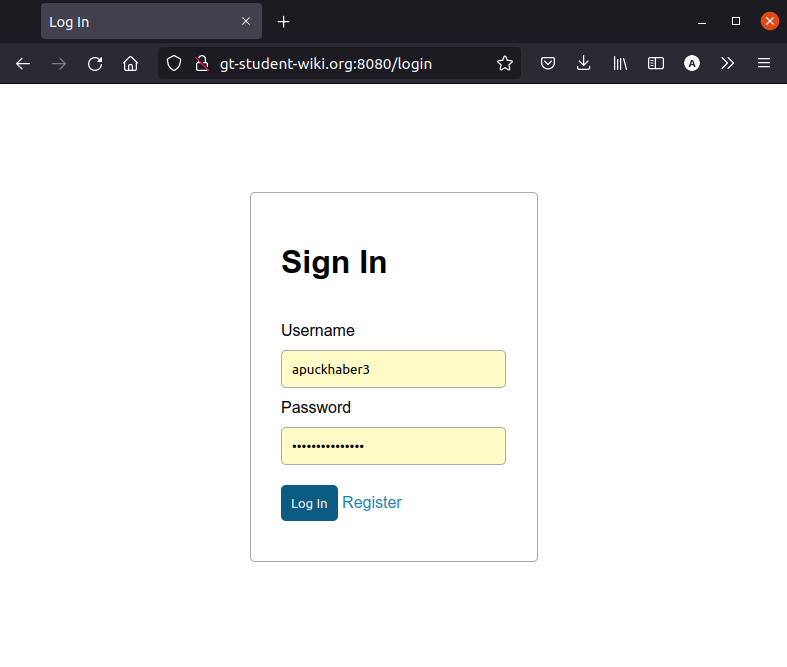
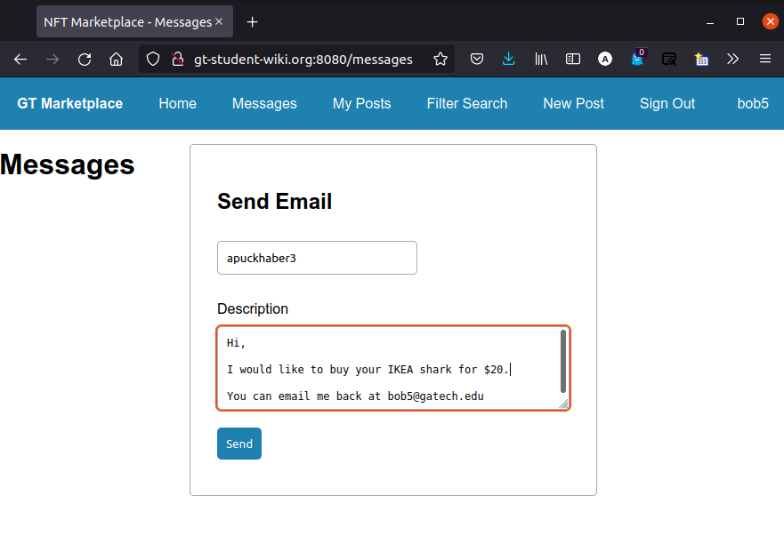

## User Guide
This tutorial will help you use our website, which can be found at [http://gt-student-wiki.org:8080](http://gt-student-wiki.org:8080)

If the website is down, you may have to compile from source [here](https://github.gatech.edu/cfarley6/CS3300-Project2). Note that the folder name has changed from `LSW` to `NFT Marketplace`, the original name of our project.

### Register / Log In
To use our website, you will need to login. 

#### Register

You must input a valid email (ends in `@gatech.edu`).
Also, the system checks for a reasonable GTID number.
However, for FERPA reasons, please don't upload your real number.
Any integer of the form `903xxxxxx` (`903` followed by any 6 digits) will suffice.

#### Login

Hopefully you remember your username/password combination!

### Home Page

On the home screen, you can see a list of all the items in the database.

### Create Post

Fill out the fields for your post, and choose the most applicable category.

If you want to upload an image, download it to your computer so you can upload it as a file.
Or, leave the image field blank, and a placeholder image will be chosen.

Back on the home page, scroll around until you find your post. Or, go to the filter tab.

### Search and Filter Posts

You can search by multiple filters, and the matching items will be shown.

### View, Edit, and Delete Your Posts

By picking an action in the dropdown menu, you can either go to an edit screen, or delete the item entirely.

### Message Seller

Once you have identified an item you want, copy the username to your clipboard. Then, go to the Messages page.

Type the recipient username and the message you want to send.
Make sure to put your contact info, because this email will be sent from the server, not you!

The resulting email. Make sure to check your junk folder!