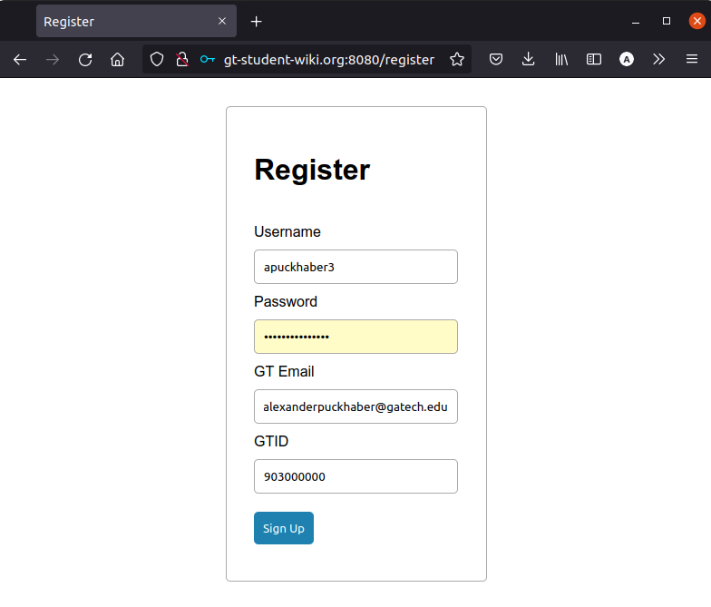

## User Guide
This tutorial will help you use our website, which can be found at [http://gt-student-wiki.org:8080](http://gt-student-wiki.org:8080)

If the website is down, you may have to compile from source [here](https://github.gatech.edu/cfarley6/CS3300-Project2). Note that the folder name has changed from `LSW` to `NFT Marketplace`, the original name of our project.

### Register / Log In
To use our website, you will need to login. 

#### Register

You must input a valid email (ends in `@gatech.edu`).
Also, the system checks for a reasonable GTID number.
However, for FERPA reasons, please don't upload your real number.
Any integer of the form `903xxxxxx` (`903` followed by any 6 digits) will suffice.

#### Login

Hopefully you remember your username/password combination!

### Home Page

### Create Post

### View, Edit, and Delete Your Posts

### Message Seller